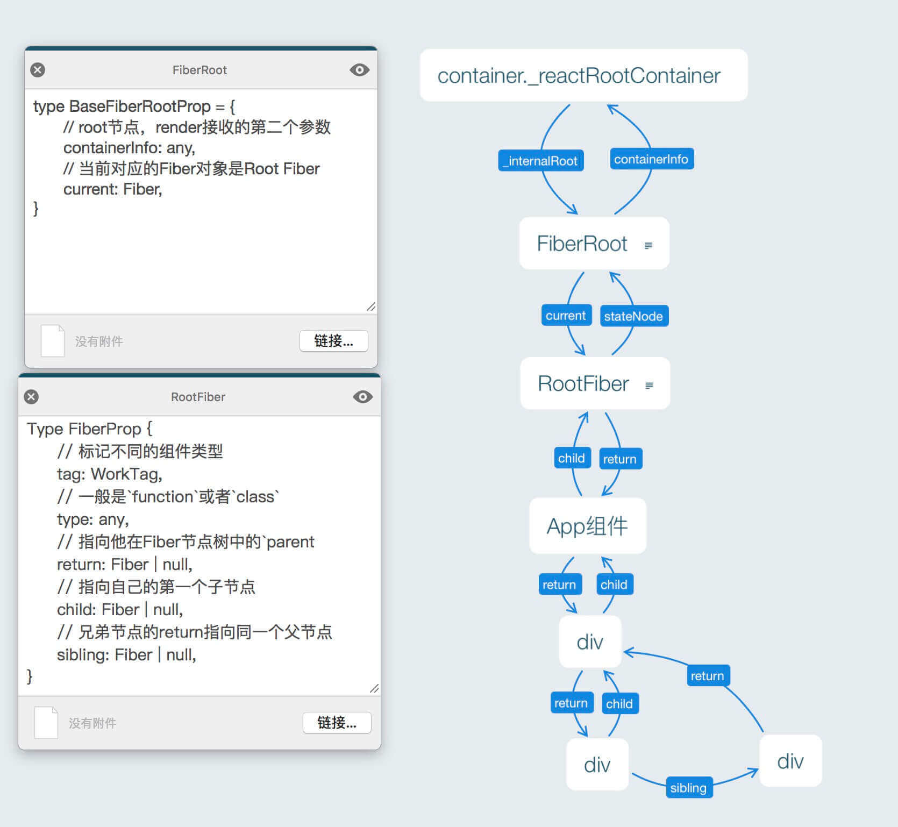

# ReactDOM.render 源码分析

> 源码入口参考[这里](../packages/react-dom/src/client/ReactDOMLegacy.js)
> 解析参考：[React16源码解读：揭秘ReactDOM.render - 小维FE - 掘金](https://juejin.cn/post/6844904042070540295#heading-0)

[TOC]
## render
下面依次分析，首先是入口方法 ``render``：
```js
export function render(
  element: React$Element<any>,
  container: Container,
  callback: ?Function,
) {
  // 检查 container 是否有效
  invariant(
    isValidContainer(container),
    'Target container is not a DOM element.',
  );

  return legacyRenderSubtreeIntoContainer(
    null,
    element,
    container,
    false,
    callback,
  );
}
```

## legacyRenderSubtreeIntoContainer
这个函数里面的调用栈比较复杂，就不贴源码了（源码看[这里](../packages/react-dom/src/client/ReactDOMLegacy.js)），先看整体结构：

```js
function legacyRenderSubtreeIntoContainer(
  parentComponent: ?React$Component<any, any>,
  children: ReactNodeList,
  container: Container,
  forceHydrate: boolean, // 是否需要强制融合，render方法传false，hydrate方法传true
  callback: ?Function,
) {
  let root: RootType = (container._reactRootContainer: any);
  let fiberRoot;
  if(!root) {
    // 首次挂载
    // 一通操作初始化一个 FiberRoot
    fiberRoot = ...;
    // Initial mount should not be batched.
    // 理解为初始化 mount 需要立即更新
    unbatchedUpdates(() => {
      // 参数的值依次为：element, fiberRoot, null, callback
      updateContainer(children, fiberRoot, parentComponent, callback);
    });
  } else {
    fiberRoot = root._internalRoot;
    updateContainer(children, fiberRoot, parentComponent, callback);
  }
  return getPublicRootInstance(fiberRoot);
}
```

先看 ``if(!root) {...}`` 里面的内容，调用了 ``legacyCreateRootFromDOMContainer`` 方法（源码见[这里](../packages/react-dom/src/client/ReactDOMLegacy.js)）并将其返回值赋给 `container._reactRootContainer`，这个方法做了两件事：
1. 根据 `forceHydrate` 判断是否需要强制融合，render 方法传 false，hydrate 方法传 true，针对客户端渲染的情况，需要将 container 容器中的所有元素移除。
2. 经过层层套娃最终返回了一个 `ReactDOMBlockingRoot` 实例（源码见[这里](../packages/react-dom/src/client/ReactDOMRoot.js)），该实例的原型上有 `render` 方法、`unmount` 属性，另有个 `_internalRoot` 属性指向 ``createRootImpl(container, LegacyRoot, forceHydrate ? { hydrate: true } : undefined)``，其实是一个 `FiberRoot`。

> Q: `LegacyRoot` 是什么？

## createRootImpl
源码见[这里](../packages/react-dom/src/client/ReactDOMRoot.js)

```js
function createRootImpl(
  container: Container,
  tag: RootTag,
  options: void | RootOptions,
) {
  // Tag is either LegacyRoot or Concurrent Root
  const hydrate = options != null && options.hydrate === true;
  const hydrationCallbacks =
    (options != null && options.hydrationOptions) || null;
  const mutableSources =
    (options != null &&
      options.hydrationOptions != null &&
      options.hydrationOptions.mutableSources) ||
    null;
  const root = createContainer(container, tag, hydrate, hydrationCallbacks);
  // 给 container 附加一个内部属性用于指向 fiberRoot 的current 属性对应的 rootFiber 节点
  markContainerAsRoot(root.current, container);

  const rootContainerElement =
    container.nodeType === COMMENT_NODE ? container.parentNode : container;
  listenToAllSupportedEvents(rootContainerElement);

  if (mutableSources) {
    for (let i = 0; i < mutableSources.length; i++) {
      const mutableSource = mutableSources[i];
      registerMutableSourceForHydration(root, mutableSource);
    }
  }

  return root;
}
```

### createContainer 创建 FiberRoot
`createContainer` 源码见[这里](../packages/react-reconciler/src/ReactFiberReconciler.old.js)
`createFiberRoot` 源码见[这里](../packages/react-reconciler/src/ReactFiberRoot.old.js)（含 FiberRootNode 的结构）

```js
export function createContainer(
  containerInfo: Container,
  tag: RootTag,
  hydrate: boolean,
  hydrationCallbacks: null | SuspenseHydrationCallbacks,
): OpaqueRoot {
  return createFiberRoot(containerInfo, tag, hydrate, hydrationCallbacks);
}

export function createFiberRoot(
  containerInfo: any,
  tag: RootTag,
  hydrate: boolean,
  hydrationCallbacks: null | SuspenseHydrationCallbacks,
): FiberRoot {
  const root: FiberRoot = (new FiberRootNode(containerInfo, tag, hydrate): any);
  if (enableSuspenseCallback) {
    root.hydrationCallbacks = hydrationCallbacks;
  }

  // Cyclic construction. This cheats the type system right now because
  // stateNode is any.
  // 创建的是 RootFiber
  const uninitializedFiber = createHostRootFiber(tag);
  root.current = uninitializedFiber;
  // 相互引用
  uninitializedFiber.stateNode = root;

  initializeUpdateQueue(uninitializedFiber);

  return root;
}
```

通过 `FiberRootNode` 的构造函数创建一个 `FiberRoot` 实例后，又通过 `createHostRootFiber` 方法（源码见[这里](../packages/react-reconciler/src/ReactFiber.old.js)）创建了 fiber tree 的根节点，即 `RootFiber`，至此我们成功地创建了一个 `FiberNode`。

> Q: FiberRoot v.s. RootFiber?
