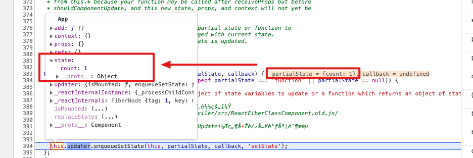

Q: setState 的参数使用 function 和 object 有什么区别？function 的优势是什么？
参考：https://juejin.im/post/6844903470613397517

Q: ``enqueueSetState`` 明明接受三个参数，但调用的时候传了四个，最后一个有什么用呢？

定义：``function (inst, payload, callback){...}``

调用：``this.updater.enqueueSetState(this, partialState, callback, setState)``

Q: 假设 partialState 是 { count: 1 }，还未执行 ``enqueueSetState``  这个函数时 this.state 已经变成 partialState 的值了，why???

其他无关问题，重点看的时候再整理到单独的文档：

1. 关键数据结构：Fiber Update
2. Fiber 的 updateQueue 为什么是个 object？一个队列为什么不是个数组呢？？？

打算先看关键数据结构 Fiber Update。